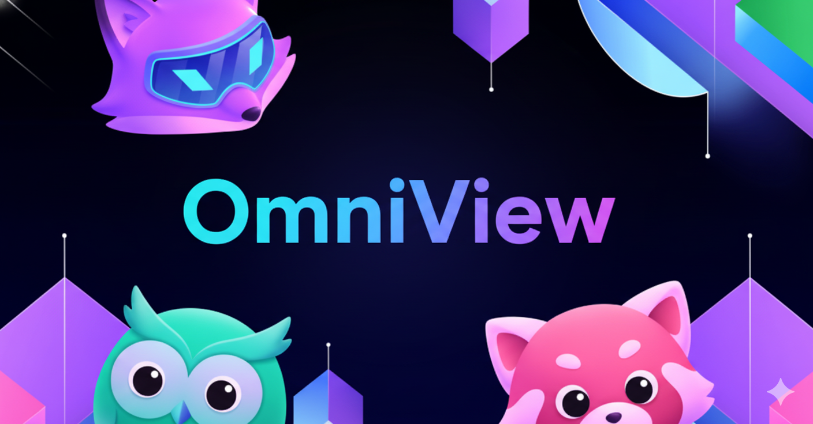

<p align="center">
  
</p>
# 👋 Welcome to OmniView!

OmniView is your friendly Go-based application designed for seamless background tracing activities. We're here to make your tracing tasks easier and more efficient! 🕵️‍♂️💻

## 🚀 Getting Started

Let's get you set up and running with OmniView! This guide will walk you through the necessary steps.

### ✅ Prerequisites

Prerequisites will be updated later. Stay tuned! 🚀

## 📖 Usage

Details on how to use OmniView will be added here soon! Stay tuned! 🚀

## 📂 Project Structure

Here's a peek at how our project is organized: 🏗️
```
.
├── main.go         # 🎯 Application entry point
├── go.mod          # 📦 Go module definition
└── README.md       # 📚 Project documentation (You are here!)
```

## 📜 License

This project is proprietary and all rights are reserved. 🔒
Please see the `LICENSE` file in this repository for full details.

Thank you for choosing OmniView! We hope you find it useful. If you have any questions or feedback, please let us know (though we don't have a formal support channel yet!). 😊