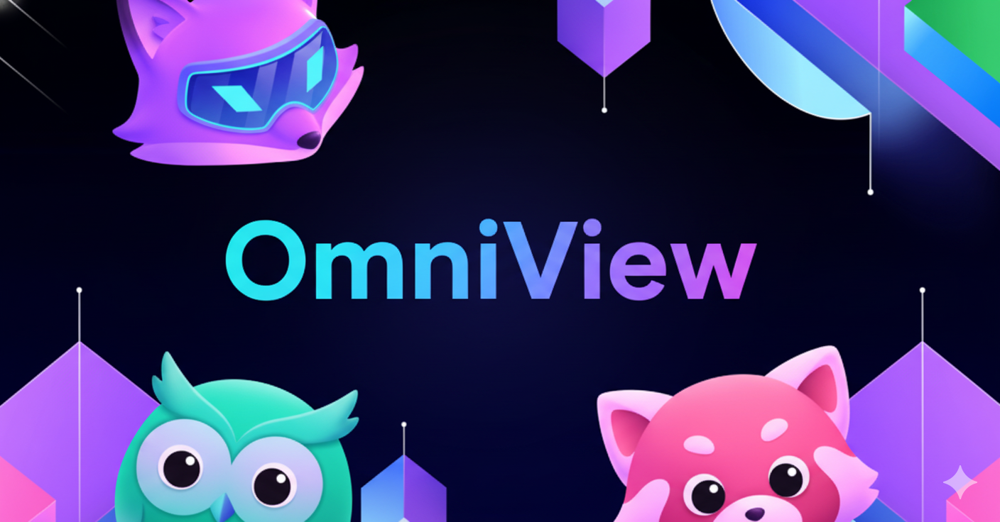

# OmniView

<p align="center">
  
</p>

<p align="center">
  
  <a href="https://github.com/BasuruK/OmniInspect/actions/workflows/go.yml">
    
  </a>
  <a href="https://github.com/BasuruK/OmniInspect">
    
  </a>
  <a href="https://github.com/BasuruK/OmniInspect">
    
  </a>
  <a href="https://github.com/BasuruK/OmniInspect">
    
  </a>
  <a href="https://github.com/BasuruK/OmniInspect">
    
  </a>
    <a href="https://github.com/BasuruK/OmniInspect">
    
  </a>
</p>

<!-- TABLE OF CONTENTS -->
<details>
  <summary>Table of Contents</summary>
  <ol>
    <li>
      <a href="#project-description">Project Description</a>
      <ul>
        <li><a href="#key-functionality">Key Functionality</a></li>
      </ul>
    </li>
    <li>
      <a href="#project-structure">Project Structure</a>
    </li>
    <li>
      <a href="#prerequisites">Prerequisites</a>
      <ul>
        <li><a href="#required-software">Required Software</a></li>
        <li><a href="#platform-specific-requirements">Platform-Specific Requirements</a></li>
      </ul>
    </li>
    <li>
      <a href="#building-from-source">Building from Source</a>
      <ul>
        <li><a href="#quick-start-recommended">Quick Start (Recommended)</a></li>
        <li><a href="#manual-build-steps">Manual Build Steps</a></li>
        <li><a href="#makefile-targets">Makefile Targets</a></li>
      </ul>
    </li>
    <li>
      <a href="#ui-structure">UI Structure</a>
      <ul>
        <li><a href="#screen-flow">Screen Flow</a></li>
      </ul>
    </li>
    <li>
      <a href="#architecture">Architecture</a>
    </li>
    <li>
      <a href="#message-flow">Message Flow</a>
    </li>
    <li><a href="#roadmap">Roadmap</a></li>
    <li><a href="#contributing">Contributing</a></li>
    <li><a href="#license">License</a></li>
    <li><a href="#citations">Citations</a></li>
  </ol>
</details>

## Project Description

OmniView (also known as OmniInspect) is a Message Passing TUI (Text User Interface) application that enables sending event messages and debug traces from Oracle Database. It provides real-time tracing capabilities through Oracle Advanced Queuing (AQ) with a blocking consumer pattern for reliable message delivery.

The application consists of two main components:

1. **Go Desktop Application** - A TUI application that connects to Oracle Database and listens for trace messages
2. **PL/SQL Package (OMNI_TRACER_API)** - Oracle database objects that handle message enqueueing and dequeuing

## Key Functionality

OmniView supports multiple methods for sending trace messages to Oracle Database:

1. **Global Trace Procedure** - For general-purpose tracing visible to all subscribers
2. **Subscriber-Specific Procedures** - For targeted messages to specific subscribers
3. **Webhook Integration** - For forwarding messages to external systems

### Global Trace Message

The primary general-purpose function for tracing:

```sql
OMNI_TRACER_API.Trace_Message(
    message_    IN CLOB,
    log_level_  IN VARCHAR2 DEFAULT 'INFO'
);
```

This procedure sends a trace message to an Oracle AQ sharded queue. The OmniView application listens for these messages and displays them in real-time.

**Parameters:**
- `message_` - The trace message content (CLOB)
- `log_level_` - Log level (e.g., 'INFO', 'WARN', 'ERROR', 'DEBUG')

**Example Usage:**
```sql
-- Send a simple trace message
BEGIN
    OMNI_TRACER_API.Trace_Message('Processing started', 'INFO');
END;

-- Send a JSON payload
BEGIN
    OMNI_TRACER_API.Trace_Message(
        '{"order_id": 12345, "status": "completed"}',
        'INFO'
    );
END;
```

### Webhook Integration

OmniInspect supports forwarding trace messages to external HTTP endpoints via webhooks. This enables integration with external monitoring systems, log aggregators, or custom alerting pipelines.

```sql
OMNI_TRACER_API.Trace_Message_To_Webhook(
    message_    IN CLOB,
    log_level_  IN VARCHAR2 DEFAULT 'INFO'
);
```

This procedure sends a trace message with a flag that signals the OmniView application to forward it to the configured webhook URL. The webhook URL must be configured in the OmniView application (prompted on first run).

**Parameters:**
- `message_` - The trace message content (CLOB)
- `log_level_` - Log level (e.g., 'INFO', 'WARN', 'ERROR', 'DEBUG')

**Prerequisites:**
- A webhook URL must be configured in OmniView (the application prompts for this on first run)
- The receiving endpoint must accept POST requests with JSON payload

**Example Usage:**
```sql
-- Send a trace message to webhook
BEGIN
    OMNI_TRACER_API.Trace_Message_To_Webhook('Alert: High latency detected', 'WARN');
END;

-- Send JSON data to webhook
BEGIN
    OMNI_TRACER_API.Trace_Message_To_Webhook(
        '{"alert": "cpu_high", "value": 95, "threshold": 90}',
        'ERROR'
    );
END;
```

> **Important Security Notice**: The `Trace_Message_To_Webhook` function includes basic SSRF (Server-Side Request Forgery) protection that blocks localhost, private IP ranges (RFC1918), link-local addresses, and common cloud metadata endpoints. However, this protection is limited and may not cover all potential security risks. Users are advised to ensure that webhook requests are sent only to secure, trusted endpoints. The maintainers of this open-source project accept no responsibility for any damages or security issues that may arise from the use of this feature. Please exercise caution and validate all webhook URLs before use in production environments.
>
>| Category | Blocked |
>|----------|---------|
>| Localhost | `localhost`, `0.0.0.0`, `::` |
>| Private IPs | `10.x.x.x`, `172.16-31.x.x`, `192.168.x.x` |
>| Link-local | `169.254.x.x` |
>| Cloud metadata | `169.254.169.254`, `metadata.google.internal` |
>| IPv6 equivalents | `::1`, `fe80::/10`, `fc00::/7` |
>
> **Note**: VPN ranges, proxy chains, DNS rebinding attacks, and other advanced SSRF vectors are **not** covered.

### Named Subscriber Procedures

OmniInspect supports multi-subscriber tracing with automatically generated, subscriber-specific procedures. When a subscriber is registered in OmniView, the system generates a custom procedure whose name is built from the subscriber's `FunnyName()` alias and that routes messages specifically to that subscriber.

Each subscriber gets their own named trace procedure in the format `TRACE_MESSAGE_<FUNNY_NAME>()`, where `<FUNNY_NAME>` is the subscriber's `FunnyName()` alias (e.g., `BARNACLE`, `WEBAPP`) — *not* the subscriber's display name. The procedure name is produced by `buildProcedureName` in `internal/service/subscribers/procedure_generator.go`, which concatenates `TRACE_MESSAGE_` with the uppercased funny name.

The procedure is created and kept in sync during registration. `SubscriberService.RegisterSubscriber` (`internal/service/subscribers/subscriber_service.go`) calls `procGen.EnsureSubscriberProcedure`, which inspects the existing `OMNI_TRACER_API` package spec/body, reuses the procedure if it is already owned by this subscriber and has the expected generated body, and otherwise injects (or upgrades) the declaration and body before redeploying the package.

**Procedure Signature:**
```sql
OMNI_TRACER_API.TRACE_MESSAGE_<FUNNY_NAME>(
    message_       IN CLOB,
    log_level_     IN VARCHAR2 DEFAULT 'INFO',
    process_name_  IN VARCHAR2 DEFAULT NULL
);
```

**Parameters:**
- `message_` - The trace message content (CLOB)
- `log_level_` - Log level (e.g., 'INFO', 'WARN', 'ERROR', 'DEBUG')
- `process_name_` - Optional process identifier. The generated body forwards this value to `Enqueue_Event___(process_name_ => process_name_, ...)`, where it is stored as the `PROCESS_NAME` field of the JSON payload (falling back to `SYS_CONTEXT('USERENV','MODULE')` and then `'OMNI_TRACER_API'` when `NULL`) — see `assets/sql/Omni_Tracer.sql`.

**Example Usage:**

For a subscriber whose `FunnyName()` is `WEBAPP`, OmniView generates the procedure `TRACE_MESSAGE_WEBAPP()`:

```sql
-- Send a message to the WEBAPP subscriber
BEGIN
    OMNI_TRACER_API.TRACE_MESSAGE_WEBAPP('User login initiated', 'INFO');
END;

-- Send with process name for better organization
BEGIN
    OMNI_TRACER_API.TRACE_MESSAGE_WEBAPP(
        'Processing payment order #12345',
        'INFO',
        'payment_service'
    );
END;

-- Send an error message
BEGIN
    OMNI_TRACER_API.TRACE_MESSAGE_WEBAPP(
        'Database connection timeout',
        'ERROR'
    );
END;
```

> **Note**: The procedure name is based on the subscriber's auto-generated funny name, not the subscriber's display name. OmniView assigns each subscriber a unique funny name (e.g., `WEBAPP`, `BARNACLE`) at registration time, and the generated procedure always uses that funny name. If you change a subscriber's display name in OmniView, the existing procedure name (and the PL/SQL code calling it) remains unchanged.

**Benefits:**
- **Subscriber-Specific**: Messages are routed directly to the target subscriber
- **Auto-Generated**: Procedures are created automatically when you register a subscriber in OmniView
- **Persistent**: Procedures persist across application restarts
- **Process Tracking**: Optional process name parameter helps organize and filter related messages

## Project Structure

```text
OmniInspect/
├── cmd/omniview/              # Main application entry point
│   └── main.go                 # Application bootstrap and initialization
├── internal/
│   ├── app/                    # Application core
│   │   └── app.go             # App version and server management
│   ├── adapter/
│   │   ├── config/            # Configuration loading
│   │   │   └── settings_loader.go
│   │   └── storage/
│   │       ├── boltdb/        # BoltDB local storage adapter
│   │       │   ├── bolt_adapter.go
│   │       │   ├── database_settings_repository.go
│   │       │   ├── permissions_repository.go
│   │       │   └── subscriber_repository.go
│   │       └── oracle/        # Oracle database adapter
│   │           ├── oracle_adapter.go
│   │           ├── queue.go
│   │           ├── subscriptions.go
│   │           ├── sql_parse.go
│   │           ├── dequeue_ops.c      # CGO bindings for dequeuing
│   │           └── dequeue_ops.h
│   │   └── ui/                # Bubble Tea TUI
│   │       ├── model.go              # Root model and screen state
│   │       ├── main_screen.go        # Main trace console view
│   │       ├── welcome.go            # Animated welcome screen
│   │       ├── loading.go            # Loading progress screen
│   │       ├── onboarding.go         # Database config form
│   │       ├── database_settings.go  # Database settings panel
│   │       ├── database_list.go      # Database list component
│   │       ├── add_database_form.go  # Add database modal
│   │       ├── chrome.go             # Layout and rendering helpers
│   │       ├── messages.go          # Bubble Tea message types
│   │       └── styles/
│   │           └── styles.go         # Lipgloss style definitions
│   ├── core/
│   │   ├── domain/            # Domain entities
│   │   │   ├── config.go
│   │   │   ├── database_settings.go
│   │   │   ├── errors.go
│   │   │   ├── permissions.go
│   │   │   ├── queue_message.go
│   │   │   └── subscriber.go
│   │   └── ports/             # Port interfaces
│   │       ├── config.go
│   │       └── repository.go
│   └── service/               # Business logic services
│       ├── permissions/       # Permission deployment and checks
│       ├── subscribers/      # Subscriber management
│       └── tracer/           # Trace message handling
│           └── tracer_service.go
├── assets/
│   ├── embed_files.go         # Embedded asset management
│   ├── ins/
│   │   └── Omni_Initialize.ins  # Initialization script
│   └── sql/
│       ├── Omni_Tracer.sql    # Main tracer PL/SQL package
│       └── Permission_Checks.sql
├── scripts/
│   ├── setup_odpi.py          # ODPI-C library setup script
│   ├── delete_queues.sql     # Cleanup script
│   └── restart_ora_listener.sh
├── third_party/
│   └── odpi/                  # ODPI-C library (Oracle DB driver for C)
│       ├── include/
│       ├── src/
│       └── lib/
├── docs/                      # Architecture documentation
├── resources/                 # Application resources
├── Makefile                   # Build automation
├── go.mod                     # Go module definition
└── omniview.bolt              # Local database (created on first run)
```

## Prerequisites

Before building OmniView, ensure you have the following installed:

### Required Software

| Requirement | Version | Description |
|-------------|---------|-------------|
| **Go** | 1.24+ | Programming language |
| **Oracle Instant Client** | 23.7+ | Oracle database client libraries |
| **GCC/Clang** | Any recent version | C compiler for CGO |
| **make** | Any recent version | Build automation |

### Platform-Specific Requirements

#### macOS (Apple Silicon)
- Oracle Instant Client for ARM64
- Download from: [Oracle Instant Client macOS ARM64](https://www.oracle.com/database/technologies/instant-client/macos-arm64-downloads.html)

#### Windows
- Oracle Instant Client for x64
- Download from: [Oracle Instant Client Windows x64](https://www.oracle.com/database/technologies/instant-client/winx64-64-downloads.html)

#### Linux
- Oracle Instant Client for Linux x64

## Building from Source

### Quick Start (Recommended)

The easiest way to set up and build the project is using the provided setup script:

```bash
# Clone the repository
git clone https://github.com/BasuruK/OmniInspect.git
cd OmniInspect

# Run the setup script with automatic build
python scripts/setup_odpi.py --make

# Run the application
./omniview
```

### Manual Build Steps

If you prefer to build manually or need more control:

#### 1. Install Oracle Instant Client

Download and extract Oracle Instant Client to the appropriate directory:

| Platform | Path | Download URL |
|----------|------|--------------|
| macOS ARM64 | `/opt/oracle/instantclient_23_7` | [macOS ARM64 Instant Client download](https://www.oracle.com/database/technologies/instant-client/macos-arm64-downloads.html) |
| Windows x64 | `C:\oracle_inst\instantclient_23_7` | [Windows x64 Instant Client download](https://www.oracle.com/database/technologies/instant-client/winx64-64-downloads.html) |
| Linux x64 | `/opt/oracle/instantclient_23_7` | [Linux x64 Instant Client download](https://www.oracle.com/database/technologies/instant-client/linux-x64-downloads.html) |

#### 2. Set Up ODPI-C Library

The ODPI-C library provides Go bindings for Oracle Database. Run the setup script:

```bash
# Without building (just setup)
python scripts/setup_odpi.py

# Or with automatic build
python scripts/setup_odpi.py --make
```

This script will:
- Download ODPI-C v5.6.4 from GitHub
- Extract header files to `third_party/odpi/include/`
- Copy source files to `third_party/odpi/src/`
- Build the ODPI-C shared library

#### 3. Build the Application

Use the Makefile to build:

```bash
# Build the application
make build

# Or with a specific version
make build VERSION=v1.0.0

# Build and run
make run
```

#### 4. Run the Application

```bash
./omniview
```

On first run, the application will:
1. Prompt you to enter your Oracle database connection details (host, port, database name, username, password)
2. Create a local BoltDB database file (`omniview.bolt`) to store your settings
3. Deploy the OMNI_TRACER_API package to your Oracle schema
4. Initialize the tracer queue
5. Register a subscriber
6. Start listening for trace messages

#### Switching to a Different Database

OmniView supports multiple database configurations with dynamic switching via the TUI. To switch databases:

1. Press `Ctrl+D` to open the Database Settings overlay
2. Select a different database from the list or add a new one
3. The application will dynamically switch to the selected database

## Makefile Targets

| Target | Description |
|--------|-------------|
| `make build` | Build the Go application |
| `make build VERSION=x.x.x` | Build with specific version |
| `make run` | Build and run the application |
| `make odpi` | Build only ODPI-C library |
| `make deps` | Check/build dependencies |
| `make clean` | Remove all build artifacts |
| `make test` | Run tests |
| `make install` | Install Go dependencies |
| `make release VERSION=x.x.x` | Build and package for distribution |
| `make publish VERSION=x.x.x` | Build, tag and push release (GitHub Actions handles packaging) |
| `make help` | Show available targets |

> **Important**: Always use `make run` or `make build` instead of `go run cmd/omniview/main.go`. The Makefile sets required CGO environment variables (library paths, rpaths) that are needed for the Oracle ODPI-C driver to compile and link correctly.

## Architecture

OmniView uses a Hexagonal (Ports and Adapters) architecture:

```text
┌─────────────────────────────────────────────────────────────────┐
│                      Application Bootstrap                      │
│                    (cmd/omniview/main.go)                       │
└─────────────────────────────────────────────────────────────────┘
                              │
                              ▼
┌─────────────────────────────────────────────────────────────────┐
│                        Services Layer                           │
│  ┌──────────────┐  ┌──────────────┐  ┌──────────────┐           │
│  │   Tracer     │  │  Permission  │  │  Subscriber  │           │
│  │   Service    │  │   Service    │  │   Service    │           │
│  └──────────────┘  └──────────────┘  └──────────────┘           │
└─────────────────────────────────────────────────────────────────┘
                              │
                              ▼
┌─────────────────────────────────────────────────────────────────┐
│                      Adapters Layer                             │
│  ┌──────────────┐  ┌──────────────┐  ┌──────────────┐           │
│  │   Oracle     │  │   BoltDB     │  │    Config    │           │
│  │   Adapter    │  │   Adapter    │  │   Loader     │           │
│  └──────────────┘  └──────────────┘  └──────────────┘           │
└─────────────────────────────────────────────────────────────────┘
                              │
                              ▼
┌─────────────────────────────────────────────────────────────────┐
│                    External Systems                             │
│  ┌──────────────┐  ┌──────────────┐                             │
│  │    Oracle    │  │    Local     │                             │
│  │  Database    │  │    Storage   │                             │
│  └──────────────┘  └──────────────┘                             │
└─────────────────────────────────────────────────────────────────┘
```

## Message Flow

```text
┌─────────────────┐     Trace_Message()      ┌─────────────────┐
│  Oracle PL/SQL  │ ────────────────────────▶│  OMNI_TRACER    │
│     Code        │                          │     QUEUE       │
└─────────────────┘                          └────────┬────────┘
                                                      │
                                                      │ Dequeue
                                                      ▼
┌─────────────────┐     Display            ┌─────────────────┐
│  OmniView TUI   │ ◀──────────────────────│   Blocking      │
│   (Console)     │                        │   Consumer      │
└─────────────────┘                        └─────────────────┘
```

## UI Structure

OmniView uses a screen-based TUI architecture built with Bubble Tea v2 and Lipgloss. The application flows through the following screens:

### Screen Flow

```
┌─────────────┐     Animation Complete      ┌─────────────┐
│  Welcome    │ ──────────────────────────▶│  Loading    │
│  (Animated  │                           │  (Progress  │
│   Logo)     │                           │   Steps)    │
└─────────────┘                           └──────┬──────┘
                                                  │
                               Config Not Found   │
                              ┌───────────────────┘
                              │
                              ▼
                     ┌─────────────┐     ┌─────────────┐
                     │ Onboarding  │     │    Main     │
                     │ (Database   │     │  (Trace     │
                     │  Config)    │     │   Console)  │
                     └─────────────┘     └──────┬──────┘
                                                  │
                                                  ▼
                                         ┌─────────────┐
                                         │  Database   │
                                         │  Settings   │
                                         │  (Overlay)  │
                                         └──────┬──────┘
                                               │
                                               ▼
                                        ┌─────────────┐
                                        │   Add       │
                                        │  Database   │
                                        │   Form      │
                                        │  (Modal)    │
                                        └─────────────┘
```

## Roadmap
  
### Completed

- [x] Trace Message View in Client
- [x] Single database sign in
- [x] Domain Driven Design refactor
- [x] Trace Message webhook integration
- [x] New UI with BubbleteaV2/Lipgloss
- [x] Multiple database support with dynamic switching
- [x] Multi-subscriber support with subscriber-specific procedure generation
- [x] Dynamic subscription management and targeted message delivery

### Planned

- [ ] Save Trace Messages to file integration
- [ ] Connection health/latency/queue/message per second checking
- [ ] Light theme support

<p align="right">(<a href="#">back to top</a>)</p>

## Contributing

Contributions are welcome. Please feel free to submit a Pull Request.

## License

Copyright (c) 2026 Basuru Balasuriya. All Rights Reserved.

This software is the exclusive property of Basuru Balasuriya ("the Author"). See the [LICENSE](LICENSE) file for full terms and conditions.

## Star History

<p align="center">
  <a href="https://star-history.com/#BasuruK/OmniInspect">
    
  </a>
</p>

## Citations

If you use OmniView in your research or project, please cite it using the following format:

### BibTeX

```bibtex
@software{Balasuriya2026OmniView,
  author  = {Basuru Balasuriya},
  title   = {OmniView: Oracle Database Message Passing TUI Application},
  year    = {2026},
  url     = {https://github.com/BasuruK/OmniInspect},
  license = {Proprietary}
}
```

### APA Style

Balasuriya, B. (2026). *OmniView: Oracle Database Message Passing TUI Application* (Version 0.1.1) [Software]. Retrieved from https://github.com/BasuruK/OmniInspect

### Chicago Style

Balasuriya, Basuru. 2026. *OmniView: Oracle Database Message Passing TUI Application* (Version 0.1.1). Software. https://github.com/BasuruK/OmniInspect.

---

<p align="center">
  Built with 💖, by Basuru Balasuriya
</p>
