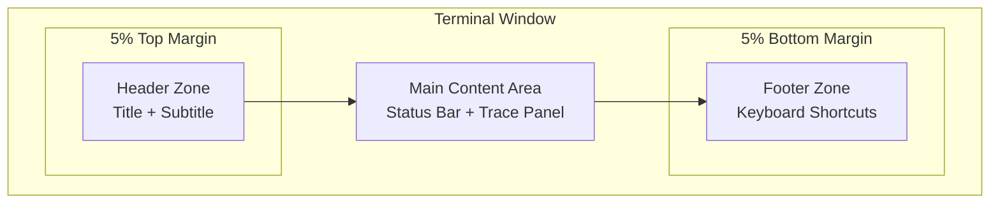
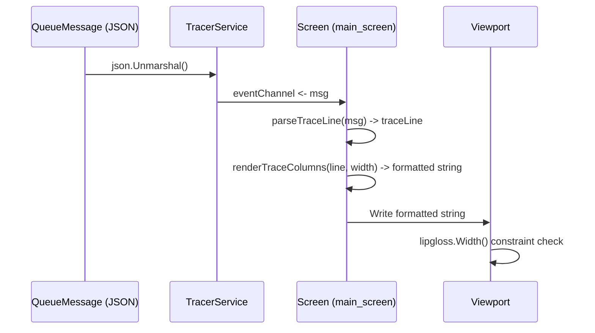

# Architecture Plan: Dynamic Frame Scaling & Column-Based Trace Display

## Context

Two related UI improvements for OmniView's trace console:

1. **Dynamic Frame Scaling**: The tracer window frame should respect window boundaries with 5% static margins for header/footer sections
2. **Column-Based Trace Display**: Parse trace messages into structured columns (Date, Level, API, Payload) for proper formatting control

---

## Problem 1: Dynamic Frame Scaling with 5% Boundary Margins

### Current State
The layout already responds to window resize via `tea.WindowSizeMsg` in [`model.go`](internal/adapter/ui/model.go:268), but header/footer sections don't enforce explicit boundary margins.

### Proposed Design



### Implementation Specification

**New Constants** (in `model.go` or `main_screen.go`):

```go
const (
    // Boundary margin as percentage of terminal dimension
    // Applied to both header and footer zones
    boundaryMarginPercent = 0.05  // 5%
    
    // Minimum margin in characters (prevents zero-margin on small terminals)
    minBoundaryMargin = 1
)
```

**Layout Calculation** (`computeMainLayout` changes):

```go
func (m *Model) computeMainLayout() mainLayoutParts {
    contentWidth, contentHeight := screenContentSize(m.width, m.height)
    
    // Calculate 5% boundary margins
    topMargin := max(int(float64(contentHeight) * boundaryMarginPercent), minBoundaryMargin)
    bottomMargin := topMargin  // Symmetric margins
    
    // Header renders in top margin zone
    header := renderScreenHeader(...)
    
    // Footer renders in bottom margin zone  
    footer := renderFooterBar(...)
    
    // Main content fills remaining space between margins
    availableContentHeight := contentHeight - topMargin - bottomMargin
    
    panelHeight := max(
        availableContentHeight - lipgloss.Height(statusBar) - panelHeightCompensation,
        minPanelHeight,
    )
    
    return mainLayoutParts{
        header:           header,
        footer:           footer,
        topMargin:        topMargin,
        bottomMargin:     bottomMargin,
        // ... rest unchanged
    }
}
```

### Files Affected
- `internal/adapter/ui/main_screen.go` - Layout computation
- `internal/adapter/ui/styles/styles.go` - Optional: new margin styles

---

## Problem 2: Column-Based Trace Message Formatting

### Current State
[`formatLogLine()`](internal/adapter/ui/main_screen.go:237) concatenates all fields into a single string:

```
2026-03-30 11:15:16 [INFO    ] OMNI_TRACER_API $$$$$$$$$$$$$$$ reminder_date_ = 2026-03-30 
```

This prevents individual column styling, alignment, and truncation logic.

### Proposed Design

**Column Definition**:

| Column | Source Field | Width | Alignment | Style |
|--------|--------------|-------|-----------|-------|
| 0 | Timestamp | 19 chars | Left | `LogTimestampStyle` (muted) |
| 1 | Log Level | 10 chars | Center | Color-coded per level |
| 2 | API/Process Name | 20 chars | Left | `LogProcessStyle` (secondary) |
| 3 | Payload | Remaining | Left | `BodyTextStyle` (default) |

**Fixed-Width Column Layout**:

```
| 2026-03-30 11:15:16 | [INFO    ] | OMNI_TRACER_API        | reminder_date_ = 2026-03-30 |
|^col0...............^|^col1.......^|^col2..................^|^col3...................|
```

### Implementation Specification

**New Types** (in `main_screen.go`):

```go
// traceColumn represents a column in the trace display
type traceColumn struct {
    content  string
    width    int
    style    lipgloss.Style
}

// traceLine represents a parsed trace message with columnar data
type traceLine struct {
    timestamp  string
    level      string  
    levelStyle lipgloss.Style  // Computed from log level
    api        string
    payload    string
    raw        *domain.QueueMessage  // Original message reference
}
```

**New Constants**:

```go
const (
    colTimestampWidth = 19   // "2006-01-02 15:04:05"
    colLevelWidth     = 10   // "[INFO    ]" with padding
    colApiWidth       = 20   // Process name truncated/padded
    colMinWidth       = 10   // Minimum terminal width to show columns
    
    // Column separators using box-drawing characters
    colSeparator = " │ "
)
```

**Column Parsing Function**:

```go
// parseTraceLine extracts structured data from a QueueMessage
func parseTraceLine(msg *domain.QueueMessage) traceLine {
    return traceLine{
        timestamp:  msg.Timestamp().Format("2006-01-02 15:04:05"),
        level:      fmt.Sprintf("[%-8s]", msg.LogLevel()),  // "[INFO    ]"
        levelStyle: getLevelStyle(msg.LogLevel()),
        api:        truncate(msg.ProcessName(), colApiWidth),
        payload:    msg.Payload(),
        raw:        msg,
    }
}

// renderTraceColumns renders a traceLine as a fixed-width formatted string
func renderTraceColumns(line traceLine, availableWidth int) string {
    // Calculate payload column width
    // = total - timestamp - level - api - separators
    fixedWidth := colTimestampWidth + colLevelWidth + colApiWidth
    separatorWidth := len(colSeparator) * 3  // 3 separators for 4 columns
    payloadWidth := availableWidth - fixedWidth - separatorWidth
    
    if payloadWidth < 5 {
        // Fallback to single-line format if too narrow
        return renderFallbackLine(line)
    }
    
    payload := truncate(line.payload, payloadWidth)
    
    // Build columnar output
    tsStyle := styles.LogTimestampStyle.Width(colTimestampWidth)
    lvlStyle := line.levelStyle.Width(colLevelWidth)
    apiStyle := styles.LogProcessStyle.Width(colApiWidth)
    payStyle := lipgloss.NewStyle().Width(payloadWidth)
    
    return lipgloss.JoinHorizontal(
        lipgloss.Top,
        tsStyle.Render(line.timestamp),
        colSeparator,
        lvlStyle.Render(line.level),
        colSeparator,
        apiStyle.Render(line.api),
        colSeparator,
        payStyle.Render(payload),
    )
}
```

**Level Style Helper** (moved/refactored from `formatLogLine`):

```go
func getLevelStyle(level domain.LogLevel) lipgloss.Style {
    base := styles.LogLevelStyle
    switch level {
    case domain.LogLevelDebug:
        return base.Foreground(styles.DebugColor)
    case domain.LogLevelInfo:
        return base.Foreground(styles.InfoColor)
    case domain.LogLevelWarning:
        return base.Foreground(styles.WarningColor)
    case domain.LogLevelError:
        return base.Foreground(styles.ErrorColor)
    case domain.LogLevelCritical:
        return base.Foreground(styles.CriticalColor)
    default:
        return base.Foreground(styles.MutedColor)
    }
}
```

**Update `updateMain` for Column Mode**:

```go
case queueMessageMsg:
    if len(m.main.messages) >= maxMessages {
        m.main.messages = m.main.messages[1:]
        m.main.renderedContent.Reset()
        for _, queuedMsg := range m.main.messages {
            m.main.renderedContent.WriteString(
                m.formatLogLineColumns(queuedMsg, m.main.viewport.Width()),
            )
            m.main.renderedContent.WriteString("\n")
        }
    } else {
        m.main.renderedContent.WriteString(
            m.formatLogLineColumns(msg.message, m.main.viewport.Width()),
        )
        m.main.renderedContent.WriteString("\n")
    }
    // ... rest unchanged
```

### Alternative: Column Mode Toggle

For terminals narrower than `colMinWidth`, fall back to compact single-line format:

```go
// formatLogLine is the legacy single-line formatter (backward compatible)
func (m *Model) formatLogLine(msg *domain.QueueMessage) string { ... }

// formatLogLineColumns is the new columnar formatter
func (m *Model) formatLogLineColumns(msg *domain.QueueMessage, viewportWidth int) string { ... }

// formatLogLineAuto selects formatter based on available width
func (m *Model) formatLogLineAuto(msg *domain.QueueMessage, viewportWidth int) string {
    if viewportWidth >= colMinWidth {
        return m.formatLogLineColumns(msg, viewportWidth)
    }
    return m.formatLogLine(msg)
}
```

### Files Affected
- `internal/adapter/ui/main_screen.go` - Column parsing and rendering
- `internal/adapter/ui/styles/styles.go` - Optional: new column-specific styles
- `internal/core/domain/queue_message.go` - No changes needed (already structured)

---

## Design Decisions (Confirmed)

| Decision | Choice |
|----------|--------|
| Frame margin scope | **Both height AND width** (5% on all sides) |
| Payload overflow | **Word-wrap with column-aware continuation** |
| Column format default | **Yes, default mode** |

### Word-Wrap Implementation Detail

When payload exceeds column width, continuation lines are indented to align under the payload column header (no repeated separators):

```
| 2026-03-30 11:15:16 │ [INFO    ] │ OMNI_TRACER_API     │ reminder_date_ = 2026-03-30 
│                     │            │                     │   and continuation text here
```

This preserves the column visual structure while allowing full message visibility.

---

## Summary of Changes

| File | Changes |
|------|---------|
| `model.go` | Add `boundaryMarginPercent` constant |
| `main_screen.go` | Add column types, constants, `parseTraceLine()`, `renderTraceColumns()`, update `updateMain` |
| `styles/styles.go` | Optional: add `ColumnSeparatorStyle`, `ColumnTimestampStyle`, etc. |

---

## Implementation Phases

### Phase 1: Frame Scaling (Problem 1)
1. Add `boundaryMarginPercent = 0.05` constant
2. Update `screenContentSize()` to apply 5% margins
3. Update `computeMainLayout()` to use margin-adjusted dimensions
4. Test with various terminal sizes

### Phase 2: Column Formatting (Problem 2)
1. Add column constants and types to `main_screen.go`
2. Implement `parseTraceLine()` function
3. Implement `renderTraceColumns()` with word-wrap support
4. Update `updateMain` message handler to use column formatter
5. Update viewport width recalculation on resize

---

## Mermaid: Implementation Flow



---

## Questions for Clarification

1. **Problem 1**: Should the 5% margin apply to both height AND width, or only height (vertical boundaries)?
   
2. **Problem 2**: For the payload column, should long messages be:
   - **Truncated** with "…" ellipsis
   - **Word-wrapped** to next line (breaking column alignment)
   - **Scrollable** within the column (complex - not recommended for MVP)

3. **Backward Compatibility**: Should the column format be the default, or should it be a toggle/setting?

4. **Minimum Terminal Size**: What is the minimum terminal size users typically run? This affects the `colMinWidth` constant.
